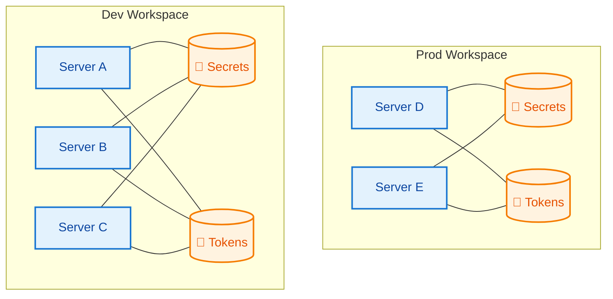

## What are Workspaces?

**Workspaces** are isolated environments within the NimbleTools MCP Platform. Each workspace provides a secure, multi-tenant space where you can deploy and manage MCP servers with complete isolation from other workspaces.

## Key Benefits

<CardGroup cols={2}>
  <Card title="Complete Isolation" icon="shield">
    Each workspace has isolated servers, secrets, tokens, and resources
  </Card>
  <Card title="Secure by Default" icon="lock">
    Workspace-scoped access tokens and encrypted credential storage
  </Card>
  <Card title="Easy Organization" icon="folder-tree">
    Organize projects, environments, or teams with separate workspaces
  </Card>
  <Card title="Independent Scaling" icon="chart-line">
    Each workspace scales independently with its own resource limits
  </Card>
</CardGroup>

## Workspace Architecture

### Multi-Tenant Security

Each workspace operates in complete isolation:




### Resource Isolation

| Resource Type | Isolation Level | Description |
|---------------|----------------|-------------|
| **MCP Servers** | Complete | Each workspace deploys its own server instances |
| **Secrets** | Complete | API keys and credentials are workspace-specific |
| **Networking** | Complete | Separate endpoints and routing per workspace |

## Common Workspace Patterns

### Environment-Based Organization

Separate workspaces for different deployment environments:

<Tabs>
  <Tab title="Development">
    ```bash
    ntcli workspace create dev --description "Development environment"
    ntcli workspace switch dev
    
    # Deploy development versions
    ntcli server deploy nationalparks-mcp --version latest
    ntcli secrets set NPS_API_KEY=dev-key-here
    ```
  </Tab>
  <Tab title="Staging">
    ```bash
    ntcli workspace create staging --description "Staging environment"
    ntcli workspace switch staging
    
    # Deploy staging versions with production-like config
    ntcli server deploy nationalparks-mcp --version stable
    ntcli secrets set NPS_API_KEY=staging-key-here
    ```
  </Tab>
  <Tab title="Production">
    ```bash
    ntcli workspace create prod --description "Production environment"
    ntcli workspace switch prod
    
    # Deploy production with scaling
    ntcli server deploy nationalparks-mcp --version stable
    ntcli server scale nationalparks-mcp 3
    ntcli secrets set NPS_API_KEY=prod-key-here
    ```
  </Tab>
</Tabs>

### Project-Based Organization

One workspace per project or application:

<CodeGroup>

```bash Web Application
ntcli workspace create web-app --description "Main web application backend"
ntcli server deploy nationalparks-mcp
ntcli server deploy weather-mcp
ntcli secrets set WEATHER_API_KEY=key1
```

```bash Mobile API
ntcli workspace create mobile-api --description "Mobile app backend services"
ntcli server deploy user-profile-mcp
ntcli server deploy notifications-mcp
ntcli secrets set PUSH_TOKEN=key2
```

```bash Analytics Pipeline
ntcli workspace create analytics --description "Data analytics and ML"
ntcli server deploy data-connector-mcp
ntcli server deploy ml-inference-mcp
ntcli secrets set DB_CONNECTION=postgres://...
```

</CodeGroup>

### Team-Based Organization

Workspaces for different teams or departments:

<AccordionGroup>
  <Accordion title="Frontend Team">
    ```bash 
    ntcli workspace create frontend-team
    # Deploy UI-focused MCP servers
    ntcli server deploy ui-components-mcp
    ntcli server deploy design-system-mcp
    ```
  </Accordion>
  
  <Accordion title="Data Science Team">
    ```bash
    ntcli workspace create data-science
    # Deploy ML and analytics servers
    ntcli server deploy ml-models-mcp
    ntcli server deploy data-viz-mcp
    ```
  </Accordion>
  
  <Accordion title="DevOps Team">
    ```bash
    ntcli workspace create devops
    # Deploy infrastructure and monitoring servers
    ntcli server deploy monitoring-mcp
    ntcli server deploy deployment-mcp
    ```
  </Accordion>
</AccordionGroup>

## Workspace Lifecycle

### Creation and Setup

<Steps>
  <Step title="Create Workspace">
    ```bash
    ntcli workspace create my-project --description "Project description"
    ```
  </Step>
  <Step title="Set Active Workspace">
    ```bash
    ntcli workspace switch my-project
    # Or use interactive selection
    ntcli workspace select
    ```
  </Step>
  <Step title="Configure Secrets">
    ```bash
    ntcli secrets set API_KEY=your-key
    ntcli secrets set DATABASE_URL=postgresql://...
    ```
  </Step>
  <Step title="Deploy Servers">
    ```bash
    ntcli server deploy nationalparks-mcp
    ntcli server deploy weather-mcp
    ```
  </Step>
</Steps>

### Daily Operations

Common workspace management tasks:

| Task | Command | Description |
|------|---------|-------------|
| **Switch workspace** | `ntcli workspace switch prod` | Change active workspace |
| **List workspaces** | `ntcli workspace list` | View all workspaces and active status |
| **View servers** | `ntcli server list` | See deployed servers in current workspace |
| **Check secrets** | `ntcli secrets list` | View configured secrets (values hidden) |
| **Generate tokens** | `ntcli token create` | Create long-lived access tokens |

### Cleanup and Deletion

<Callout type="warning">
  **Destructive Operation**: Deleting a workspace removes all servers, secrets, and data permanently.
</Callout>

```bash
# List workspace resources before deletion
ntcli server list
ntcli secrets list

# Delete individual resources first (optional)
ntcli server remove nationalparks-mcp
ntcli secrets unset API_KEY

# Delete entire workspace
ntcli workspace delete my-project --force
```

## Access Control & Security

### Workspace-Scoped Tokens

Each workspace uses isolated access tokens:

```bash
# Generate workspace-specific token
ntcli workspace switch dev
ntcli token refresh
# Token only works for 'dev' workspace

# Switch workspace, get different token
ntcli workspace switch prod  
ntcli token refresh
# Token only works for 'prod' workspace
```

### Credential Isolation

Secrets and API keys are completely isolated:

<Tabs>
  <Tab title="Development">
    ```bash
    ntcli workspace switch dev
    ntcli secrets set DATABASE_URL=postgresql://dev-db/myapp
    ntcli secrets set API_KEY=dev-api-key
    ```
  </Tab>
  <Tab title="Production">
    ```bash
    ntcli workspace switch prod
    ntcli secrets set DATABASE_URL=postgresql://prod-db/myapp
    ntcli secrets set API_KEY=prod-api-key
    ```
  </Tab>
</Tabs>

Even with the same secret names, values are completely separate and secure.

## Best Practices

<CardGroup cols={2}>
  <Card title="Environment Separation" icon="arrows-split-up-and-left">
    Use separate workspaces for dev, staging, and production
  </Card>
  <Card title="Descriptive Naming" icon="tag">
    Use clear, descriptive names and descriptions for workspaces
  </Card>
  <Card title="Secret Management" icon="key">
    Use workspace-specific secrets, never share credentials
  </Card>
  <Card title="Regular Cleanup" icon="broom">
    Delete unused workspaces to avoid unnecessary costs
  </Card>
</CardGroup>

### Workspace Naming Conventions

<AccordionGroup>
  <Accordion title="Environment-based">
    ```bash
    my-app-dev
    my-app-staging  
    my-app-prod
    ```
  </Accordion>
  
  <Accordion title="Feature-based">
    ```bash
    user-auth-feature
    payment-integration
    analytics-dashboard
    ```
  </Accordion>
  
  <Accordion title="Team-based">
    ```bash
    frontend-team
    backend-team
    data-science
    ```
  </Accordion>
</AccordionGroup>

## Integration with Claude Desktop

Each workspace can generate its own Claude Desktop configuration:

```bash
# Switch to desired workspace
ntcli workspace switch prod

# Generate Claude config for this workspace's servers
ntcli server claude-config nationalparks-mcp
```

The generated configuration includes workspace-specific endpoints and tokens, ensuring Claude Desktop only accesses the intended workspace.

## Related Commands

<CardGroup cols={2}>
  <Card
    title="workspace create"
    icon="plus"
    href="/commands/workspace/create"
  >
    Create a new workspace
  </Card>
  <Card
    title="workspace list"
    icon="list"
    href="/commands/workspace/list"
  >
    List all workspaces
  </Card>
  <Card
    title="workspace switch"
    icon="right-left"
    href="/commands/workspace/switch"
  >
    Switch active workspace
  </Card>
  <Card
    title="workspace delete"
    icon="trash"
    href="/commands/workspace/delete"
  >
    Delete a workspace
  </Card>
</CardGroup>