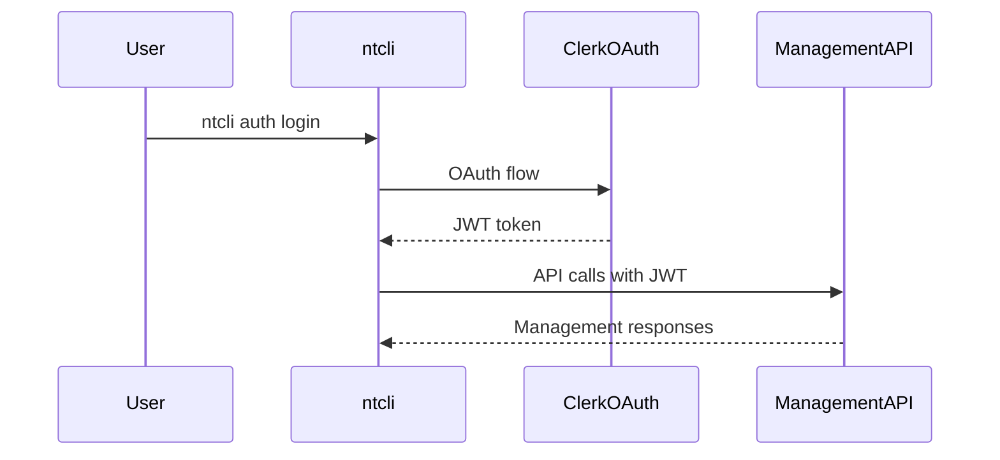
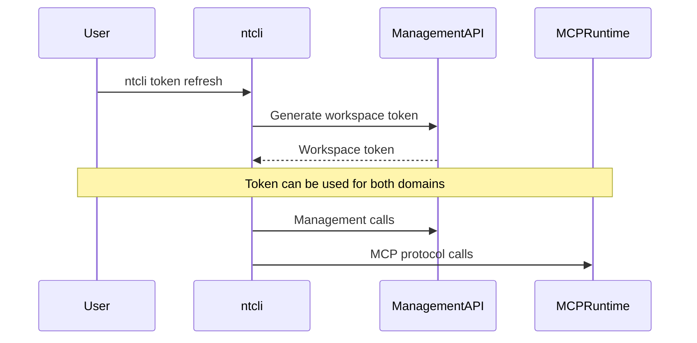

## Overview

NimbleTools uses a dual-domain architecture that separates management operations from MCP runtime operations, providing clear separation of concerns and optimized performance for different use cases.

## Domain Architecture

### Management API Domain

<ResponseField name="api.nimbletools.dev" type="string">
  Handles management operations including workspace administration, token management, server deployment, and configuration
  
  **Primary Use**: Administrative operations via ntcli  
  **Authentication**: Clerk OAuth + Workspace tokens
</ResponseField>

### MCP Runtime Domain  

<ResponseField name="mcp.nimbletools.dev" type="string">
  Handles MCP protocol operations with optimized, simplified URLs for direct server communication
  
  **Primary Use**: MCP tool calls and server communication  
  **Authentication**: Workspace tokens only
</ResponseField>

## URL Structure Comparison

### Management API Endpoints

Management operations use RESTful URL patterns:

```
https://api.nimbletools.dev/v1/workspaces
https://api.nimbletools.dev/v1/workspaces/{uuid}
https://api.nimbletools.dev/v1/workspaces/{uuid}/servers
https://api.nimbletools.dev/v1/workspaces/{uuid}/servers/{server-id}
https://api.nimbletools.dev/v1/workspaces/{uuid}/tokens
https://api.nimbletools.dev/v1/workspaces/{uuid}/secrets
```

### MCP Runtime Endpoints

MCP operations use simplified, direct paths for performance:

```
https://mcp.nimbletools.dev/{uuid}/{server-id}/mcp
```

**Current Format**:
```
https://mcp.nimbletools.dev/{uuid}/{server-id}/mcp
```

## API Usage by Component

### ntcli Commands

| Command Group | API Domain | Purpose |
|---------------|------------|---------|
| `auth` | Management | Clerk OAuth authentication |
| `workspace` | Management | Workspace CRUD operations |
| `token` | Management | Token lifecycle management |
| `server deploy/list/info` | Management | Server deployment and metadata |
| `server logs/scale/remove` | Management | Server operations |
| `secrets` | Management | Secret management |
| `mcp connect/tools/call` | **MCP Runtime** | Direct MCP protocol operations |
| `server claude-config` | Both | Generates runtime URLs with management metadata |

### Integration Tools

| Integration | Primary Domain | Notes |
|-------------|----------------|--------|
| **Claude Desktop** | MCP Runtime | Uses simplified URLs via HTTP bridge |
| **LangChain** | MCP Runtime | Direct HTTP calls to MCP endpoints |
| **Custom Scripts** | Management | For deployment, token management |
| **CI/CD Pipelines** | Management | Automated deployment workflows |

## Authentication Flow

### Clerk Authentication (Management)



### Workspace Token Authentication (Both Domains)



## Environment Variables

Configure both domains independently:

```bash
# Production (default)
export NTCLI_MANAGEMENT_API_URL=https://api.nimbletools.dev
export NTCLI_MCP_API_URL=https://mcp.nimbletools.dev

# Development
export NTCLI_MANAGEMENT_API_URL=https://dev-api.nimbletools.dev
export NTCLI_MCP_API_URL=https://dev-mcp.nimbletools.dev

# Enterprise
export NTCLI_MANAGEMENT_API_URL=https://management.company.com
export NTCLI_MCP_API_URL=https://mcp.company.com
```


## Benefits of Dual-Domain Architecture

### Performance Optimization

- **MCP Runtime**: Simplified URLs reduce parsing overhead
- **Management API**: RESTful structure for complex operations
- **Caching**: Domain-specific caching strategies
- **Load Balancing**: Independent scaling per domain

### Security Separation

- **Management API**: Full authentication and authorization
- **MCP Runtime**: Streamlined token-only authentication
- **Rate Limiting**: Different limits per domain and use case
- **Monitoring**: Separate metrics and logging

### Development Experience

- **Clear Separation**: Management vs. runtime operations
- **Simpler Integration**: Direct MCP URLs for external tools
- **Better Debugging**: Domain-specific error handling
- **Future Extensibility**: Independent domain evolution

## Error Handling

### Management API Errors

```json
{
  "error": {
    "code": "WORKSPACE_NOT_FOUND",
    "message": "Workspace not found",
    "details": {"workspace_id": "uuid"}
  }
}
```

### MCP Runtime Errors

```json
{
  "jsonrpc": "2.0",
  "error": {
    "code": -32600,
    "message": "Invalid Request",
    "data": {"details": "Server not found"}
  }
}
```

### Common Error Resolution

| Error | Domain | Solution |
|-------|---------|-----------|
| **401 Unauthorized** | Management | Run `ntcli auth login` |
| **401 Unauthorized** | MCP Runtime | Run `ntcli token refresh` |
| **404 Not Found** | Management | Check workspace/server exists |
| **404 Not Found** | MCP Runtime | Verify server deployment status |

## Related Documentation

<CardGroup cols={2}>
  <Card
    title="Environment Variables"
    icon="gear"
    href="/dev/environment-variables"
  >
    Configure API endpoints
  </Card>
  <Card
    title="Token Management"
    icon="key"
    href="/cli/commands/token/create"
  >
    Workspace token operations
  </Card>
  <Card
    title="Claude Integration"
    icon="brain"
    href="/dev/examples/claude-desktop"
  >
    MCP runtime usage examples
  </Card>
  <Card
    title="LangChain Integration"
    icon="link"
    href="/dev/examples/langchain-integration"
  >
    Custom MCP runtime integration
  </Card>
</CardGroup>