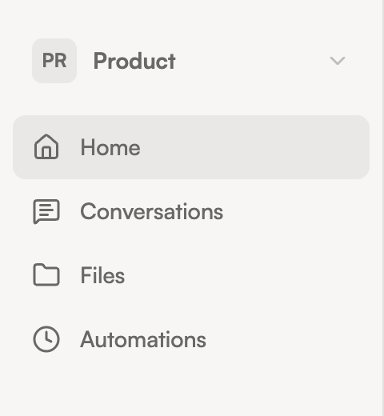

import { Aside } from '@astrojs/starlight/components';

Apps give the agent specific capabilities — a calendar app lets it check your schedule, a notes app lets it search meeting notes, a database app lets it query data. Each installed app appears in the sidebar.

## Browsing your apps

Installed apps show up in the sidebar with an icon and label. Click an app to open its interface in the main content area. Some apps have full UIs (dashboards, forms, data views), while others are tool-only and work entirely through chat.

When you open an app, the chat panel automatically scopes to that app — the agent knows you're focused on it and prioritizes its tools.

## Installing new apps

You don't need to go anywhere special to install apps. Just ask the agent:

> "I need to connect to my Granola meeting notes. Can you set that up?"

The agent will:
1. Search the app registry for a matching bundle
2. Present options to you
3. Install your choice

Some apps need credentials (like an API key) to connect to external services. The agent will ask you for these during setup.

<Aside type="tip">
  If you're not sure what's available, ask: "What apps can I install?" The agent will search the registry and show you what's out there.
</Aside>

## App interfaces

Apps that include a UI render inside the main content area as interactive panels. You can interact with the app UI directly (clicking buttons, filling forms, viewing data) while also chatting with the agent about what you see.

The chat panel and app content work side by side — ask the agent a question about the data you're looking at, or ask it to take an action in the app.

## Checking app status

Open **Settings** from the workspace selector dropdown, then navigate to the **About** tab. You'll see a table of all installed apps with their version, status (running, starting, or crashed), and how many tools each provides.
