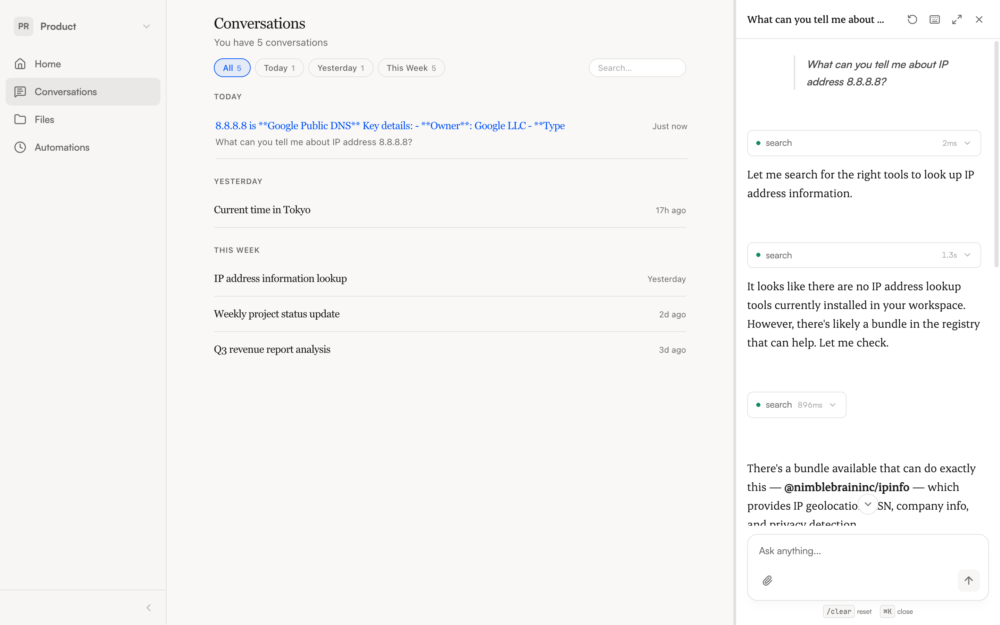

import { Aside } from '@astrojs/starlight/components';

The chat panel is where you interact with the NimbleBrain agent. Type a message, and the agent processes it — calling tools, fetching data, and streaming the response back to you.

## Sending a message

Type in the input field at the bottom of the chat panel and press **Enter** to send. For multi-line messages, use **Shift+Enter** to add a new line.

You can also:

- **Paste images** directly from your clipboard into the input
- **Drag and drop files** onto the input — they appear as chips you can remove before sending
- **Click the attachment icon** to browse for files

See [Attaching Files](/guide/files) for supported formats.

## What you see during a response

After you send a message, the agent works through your request. You'll see three states:

- **Thinking** — The agent is processing your message and deciding what to do
- **Streaming** — Text is arriving from the model in real time
- **Working** — A tool call is in progress (e.g., searching your calendar, querying a database)

Tool calls appear inline as expandable cards. Each shows the tool name, which app it belongs to, and whether it succeeded or failed. You can expand a card to see the details of what the tool returned.

## App context

When you have an app open in the main content area and send a chat message, the agent knows which app you're focused on. It prioritizes that app's tools and tailors its response accordingly.

For example, if you have a calendar app open and ask "What's on my schedule?", the agent knows to use the calendar tools rather than searching across all installed apps.

## Tips for effective prompting

- **Be specific.** "Search for MCP servers related to Slack" works better than "find me something."
- **Name the app when it matters.** If you have multiple apps, say "Use Granola to list my meetings" rather than just "list meetings."
- **Ask the agent to install what you need.** The agent can search for and install new apps on its own — just describe what you're looking for.
- **Break complex requests into steps.** For multi-part tasks, walk the agent through what you need rather than asking for everything at once.

## Chat panel modes

The chat panel has three modes you can switch between:

| Mode | What it looks like | When to use it |
|------|-------------------|----------------|
| **Closed** | Small button in bottom-right corner | When you're focused on an app and don't need chat |
| **Sidebar** | Fixed panel on the right (380px) | Default mode — chat alongside an app |
| **Fullscreen** | Chat fills the entire content area | For focused, longer conversations |

Use the keyboard shortcuts to switch quickly — see [Keyboard Shortcuts](/guide/shortcuts).

## Starting a new conversation

Click the **New conversation** button at the top of the chat panel to start fresh. Your previous conversation is saved and you can return to it anytime from the conversation history.

<Aside type="tip">
  Type `/clear` in the chat input to quickly start a new conversation without clicking the button.
</Aside>

## Cost transparency

Each assistant response shows a small token count breakdown — how many tokens were used for input and output. This helps you understand usage if your team tracks costs.
