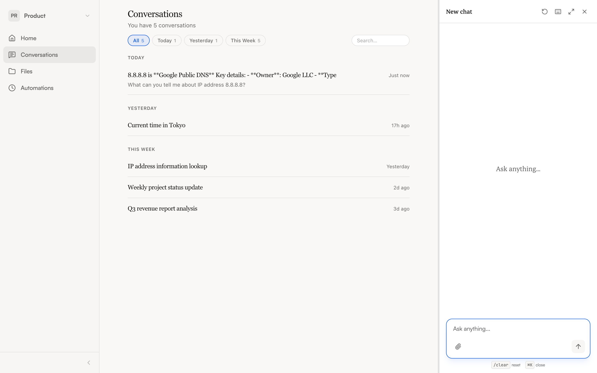

import { Aside } from '@astrojs/starlight/components';

NimbleBrain saves every conversation automatically. You can pick up where you left off, share conversations with teammates, or start fresh at any time.

## Finding past conversations

Open **Conversations** from the sidebar to see your history. Each conversation shows:

- **Title** — Auto-generated from your first message
- **Timestamp** — When the conversation last had activity
- **Participant count** — If the conversation is shared with others

Click any conversation to load it in the chat panel and continue where you left off.

## Resuming a conversation

Select a conversation from the history list. The full message history loads, and any new message you send continues that conversation. The agent has the full context of everything discussed previously.

<Aside type="tip">
  You can link directly to a conversation by sharing the URL. When someone opens it, the conversation loads automatically in their chat panel.
</Aside>

## Shared conversations

Conversations can be shared with other members of your workspace for collaborative chat.

When a conversation is shared:

- All participants can send messages and see responses in real time
- **Your messages** appear as usual on the right side
- **Other participants' messages** show a colored dot and name label, so you can tell who said what
- Each participant gets a unique accent color on their messages

If someone sends a message while you're viewing the conversation, you see the agent's response stream live — the same way you'd see your own.

## Auto-titling

NimbleBrain generates a title for each conversation after the first response. The title appears in the conversation list and in the chat panel header. Click the title in the chat header to copy the conversation ID if you need to share it.

## Starting fresh

Click **New conversation** in the chat panel header, or type `/clear` in the input. Your previous conversation is saved — you can always return to it.
