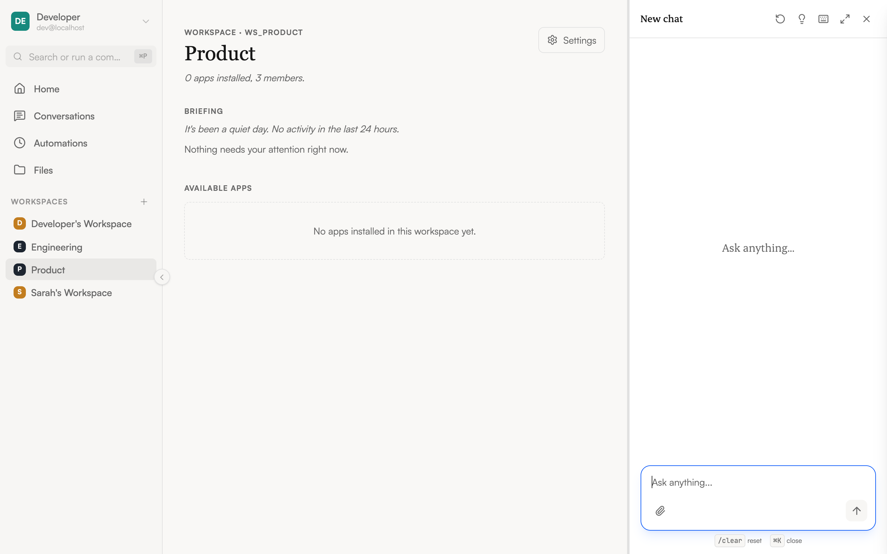

import { Aside } from '@astrojs/starlight/components';

When you sign in to NimbleBrain, you land on the main workspace view. The interface has three main areas.

## Layout overview

### Sidebar (left)

The sidebar is your main navigation. From top to bottom:

- **Avatar / workspace navigator** — At the **top-left**, your avatar anchors the sidebar. Open it to switch workspaces, reach **Profile settings**, or **Sign out**.
- **Home** — Returns to the workspace home screen.
- **Conversations** — Opens your conversation history (owned by you, across all workspaces).
- **Automations** — Opens your scheduled agent runs.
- **Files** — Opens files you've shared with the agent.
- **Apps** — Each installed app appears as a sidebar item. Click one to open it in the main content area.
- **Workspaces** — The workspaces you belong to, for switching the focused workspace.
- **Collapse toggle** — On the right edge of the sidebar (or `⌘B` / `Ctrl-B`), collapse it to icons only for more screen space.

The Home / Conversations / Automations / Files nav is identity-level — it stays the same regardless of which workspace is active. Switching workspaces just re-points the workspace-scoped links and the active tool set.

### Main content (center)

This area shows whatever you've selected — an app's interface, the home screen, or settings pages. When you click an app in the sidebar, its UI loads here.

### Chat panel (right)

The chat panel is where you talk to the agent. It floats on the right side and can be:

- **Closed** — A small button in the bottom-right corner. Click it to open chat.
- **Sidebar mode** — A fixed panel alongside the main content. This is the default when you open chat.
- **Fullscreen mode** — Chat takes over the entire content area for focused conversations.

Toggle between these modes with keyboard shortcuts or by clicking the expand/collapse icons in the chat header.

When a tool or app returns a document, the chat shows an artifact chip; clicking it opens the **Artifacts panel** — a slide-out drawer over the content area that shows the full document with copy and download actions. See [Chat](/using/chat#the-artifacts-panel) for details.

<Aside type="tip">
  On mobile devices, the sidebar becomes a slide-out drawer and the chat panel takes the full screen when open.
</Aside>

## Responsive behavior

NimbleBrain adapts to your screen size:

| Screen | Sidebar | Chat |
|--------|---------|------|
| **Desktop** (1024px+) | Full sidebar with labels | Side panel or fullscreen |
| **Tablet** (768–1023px) | Collapsed to icons | Side panel or fullscreen |
| **Mobile** (< 768px) | Hidden, swipe to open | Fullscreen only |
