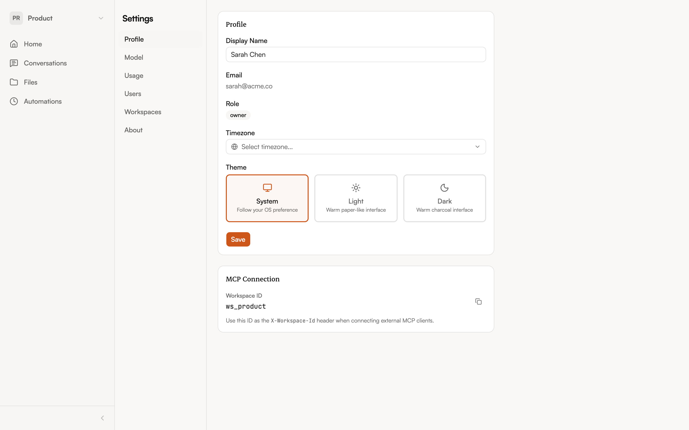
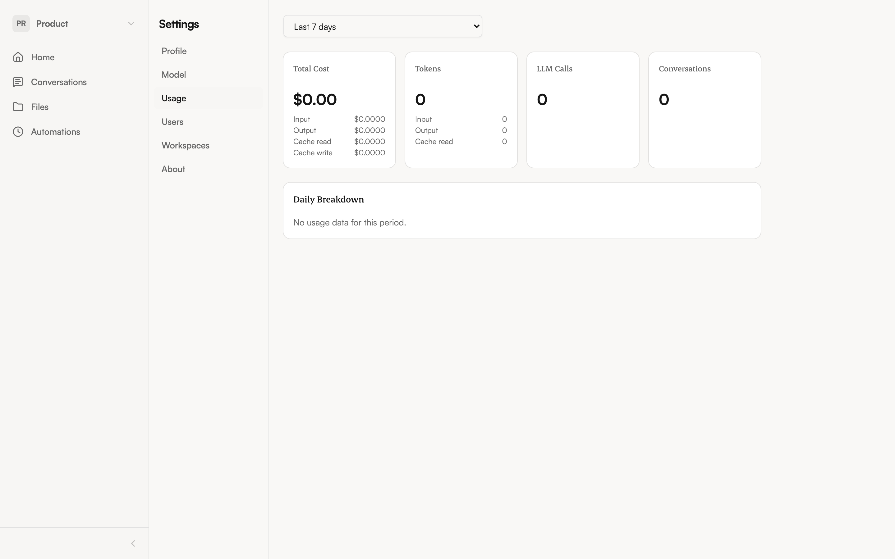

import { Aside } from '@astrojs/starlight/components';

Open settings from the **workspace selector** dropdown in the sidebar — click your workspace name, then select **Settings**.

## Profile

The Profile tab lets you customize your identity:

- **Display Name** — How your name appears to teammates in shared conversations
- **Email** — Your login email (read-only)
- **Role** — Your role in the current workspace (read-only)
- **Timezone** — Used for scheduling and time-related responses
- **Theme** — Choose between System (follows your OS), Light, or Dark

Click **Save** after making changes.

## Model selection

The Model tab lets you choose which AI models the agent uses:

- **Default model** — The primary model for chat conversations
- **Fast model** — A faster model for quick responses when selected
- **Reasoning model** — A model optimized for complex, multi-step reasoning

Your admin may have pre-configured these, but you can adjust them to your preference. The dropdown shows available models from configured providers.

You can also adjust:

- **Max iterations** — How many tool-call loops the agent can run per response
- **Max input/output tokens** — Limits on conversation and response length

<Aside type="tip">
  If you're unsure which model to pick, the defaults work well for most tasks. You might switch to the fast model for simple questions and the reasoning model for complex analysis.
</Aside>

## Usage analytics

The Usage tab shows how your workspace is using the platform:

- **Cost over time** — A chart showing daily, weekly, or monthly spending
- **Token breakdown** — Input tokens, output tokens, cache reads, and cache creation
- **Model usage** — Which models are being used and how much each costs
- **Activity stats** — Total LLM calls, average response time, and conversation count

Use the period selector (Day / Week / Month / All) to adjust the time range.

## MCP connection

The Profile tab includes a **MCP Connection** card with your workspace ID. If you want to connect an external client (like Claude Desktop or VS Code) to your NimbleBrain instance, you'll need this ID. See [Connecting External Clients](/guide/mcp-connect) for setup instructions.
