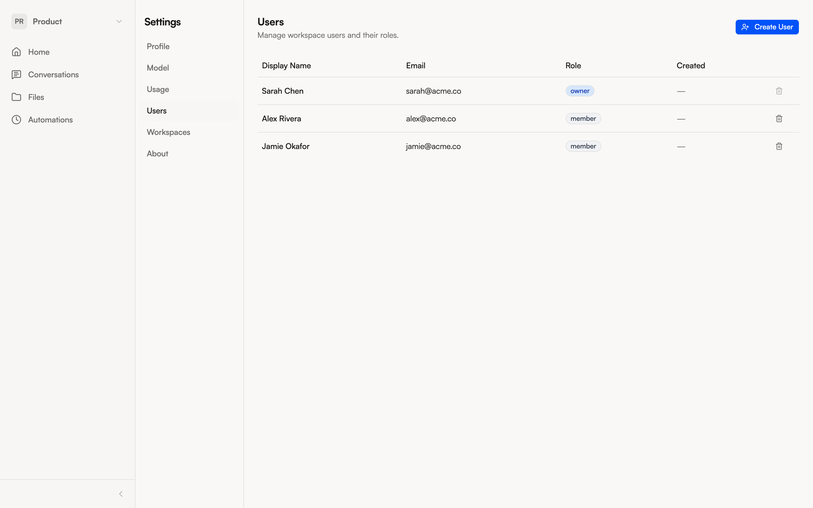

import { Aside } from '@astrojs/starlight/components';

<Aside type="note">
  Team management requires the **Owner** or **Admin** role in your workspace. If you don't see these options, ask your workspace owner.
</Aside>

## Inviting users

To add someone to your NimbleBrain instance:

1. Open **Settings** from the workspace selector dropdown
2. Go to the **Users** tab
3. Enter the person's email address in the invite field
4. Click **Add**

The new user receives an account and can sign in. You'll then need to add them to the appropriate workspace(s).

## Adding members to a workspace

To give a user access to a specific workspace:

1. Go to **Settings > Workspaces**
2. Click the workspace you want to manage
3. Add the user and assign their role

Or ask the agent directly:

> "Add sarah@example.com to the Engineering workspace as a member"

## Roles

| Role | Manage members | Manage apps | View all conversations | Chat & use tools |
|------|:---:|:---:|:---:|:---:|
| **Owner** | Yes | Yes | Yes | Yes |
| **Admin** | Yes | Yes | Yes | Yes |
| **Member** | — | — | Shared only | Yes |

The key difference: **Members** can only see conversations that have been explicitly shared with them. **Admins** and the **Owner** can view all conversations in the workspace for oversight purposes.

## Removing users

In the **Users** tab, click the delete icon next to a user to remove their account. This revokes their access but does not delete their past conversations.

<Aside type="caution">
  Removing a user is immediate — they lose access to all workspaces on the next request. Their existing conversations remain in the workspace but become inaccessible to them.
</Aside>
