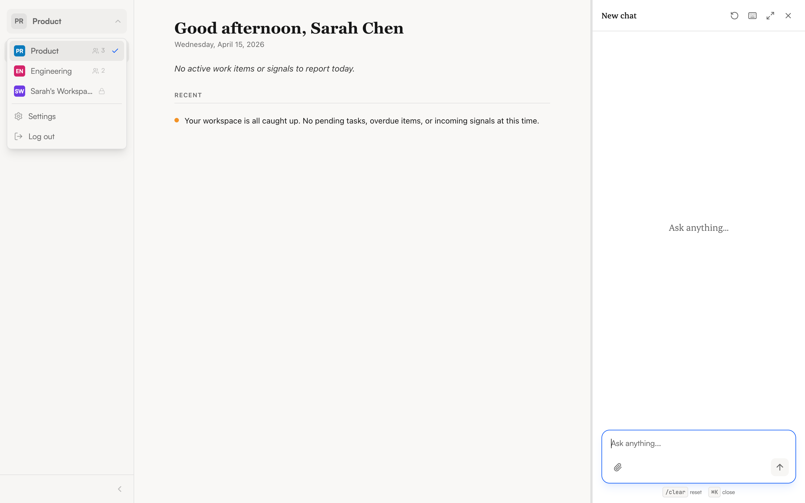

import { Aside } from '@astrojs/starlight/components';

Workspaces keep things organized. Each workspace has its own set of apps, conversations, and team members. Your admin may set up workspaces by team, project, or department — for example, an "Engineering" workspace with developer tools and a "Sales" workspace with CRM integrations.

## Switching workspaces

Click the **workspace selector** at the top of the sidebar. A dropdown shows all workspaces you belong to, with the active one marked. Click a different workspace to switch.

When you switch:
- The sidebar updates to show that workspace's apps
- Conversations in the chat panel are from that workspace
- The agent only has access to tools installed in the active workspace

## What workspaces isolate

| Scoped to workspace | Shared across workspaces |
|---------------------|-------------------------|
| Installed apps and their tools | Your user account and login |
| Conversations and history | Your profile settings (name, theme, timezone) |
| Team members and roles | |

## Roles

Every workspace member has a role that determines what they can do:

| Role | What you can do |
|------|----------------|
| **Owner** | Everything — manage members, apps, and settings. Cannot be removed. |
| **Admin** | Manage members and apps. Can view all conversations, including private ones. |
| **Member** | Chat, use tools, and view shared conversations. Cannot manage other members. |

<Aside type="tip">
  Not sure what role you have? Check the workspace selector dropdown — your role appears next to the workspace name. Or go to **Settings > Profile** where your role is shown.
</Aside>

## Personal workspaces

You may have a personal workspace that's just for you — it shows a lock icon in the workspace selector. This is a private space where you can experiment with apps and conversations without affecting your team.
