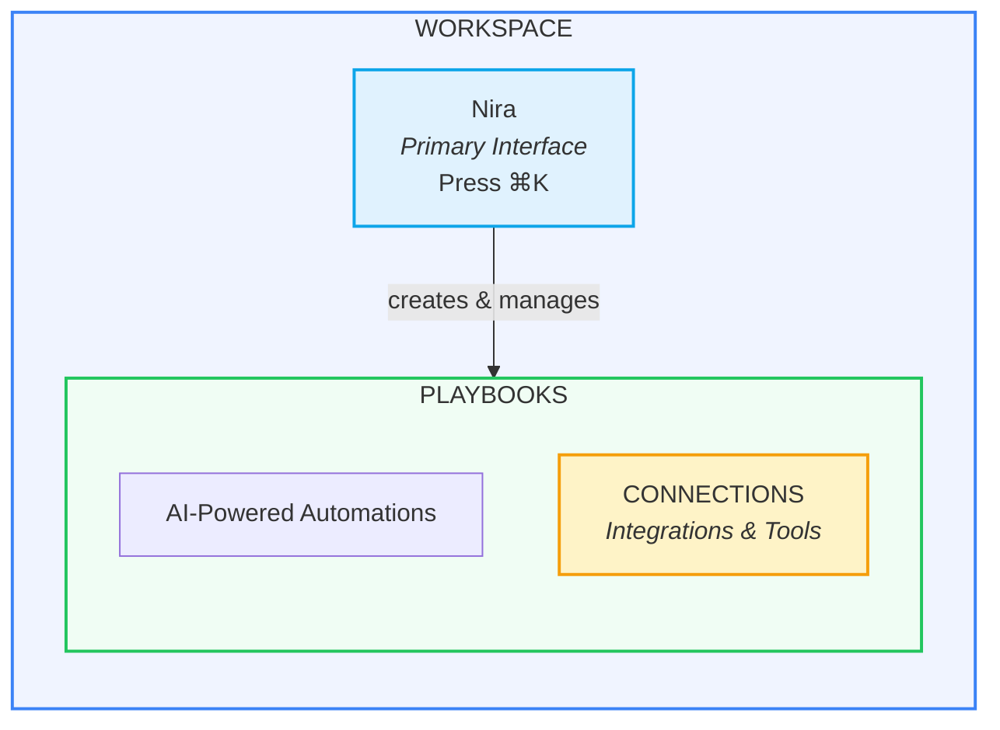
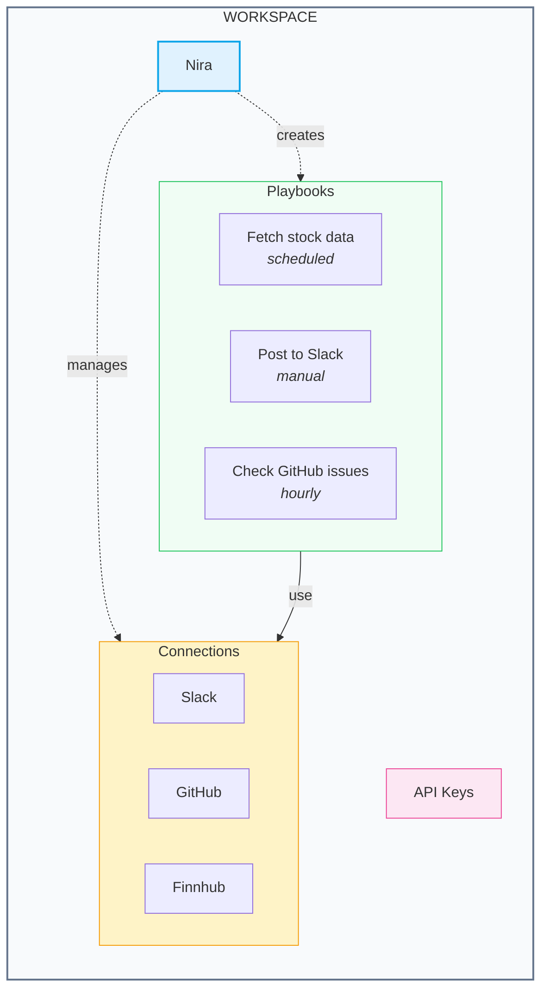

Before diving into NimbleBrain Studio, it helps to understand the core concepts and how they work together. This page defines the key terminology you'll encounter throughout the platform.

## Platform Overview

NimbleBrain Studio is an **AI-native automation platform** where Nira is your primary interface. Press **⌘K** (Mac) or **Ctrl+K** (Windows) anywhere to open Nira and start building automations through conversation.



## Key Concepts

### Workspace

A **Workspace** is your isolated environment within NimbleBrain Studio. Think of it as a project folder that contains all your automations, connections, and settings.

<CardGroup cols={2}>
  <Card title="Isolation" icon="shield">
    Each workspace is completely separate. Playbooks in one workspace cannot access data in another.
  </Card>
  <Card title="Team Collaboration" icon="users">
    Invite team members to collaborate within a workspace with role-based permissions.
  </Card>
</CardGroup>

**Key points:**
- All playbooks and connections are scoped to a workspace
- API keys are workspace-specific
- You can have multiple workspaces for different projects or teams

---

### Nira

**Nira** is your AI assistant and the primary way to interact with NimbleBrain Studio. Instead of clicking through menus and forms, you describe what you want in natural language, and Nira builds it for you.

<CardGroup cols={2}>
  <Card title="Primary Interface" icon="message-bot">
    Nira is the main way to interact with Studio. Press **⌘K** (Mac) or **Ctrl+K** (Windows) to open Nira anywhere.
  </Card>
  <Card title="Conversation-Driven" icon="comments">
    Build automations through natural conversation. Nira understands business language, not just technical terms.
  </Card>
</CardGroup>

**Nira can:**
- Create playbooks from natural language descriptions
- Select and configure the right tools automatically
- Help troubleshoot issues with your automations
- Answer questions about the platform
- Search and navigate your workspace

<Tip>
**Example:** "Create a playbook that checks our GitHub repository for new issues every hour and posts a summary to Slack" - Nira will build this entire automation for you.
</Tip>

[Learn more about Nira](/studio/nira)

---

### Playbook

A **Playbook** is an AI-powered automation defined in natural language. It's the fundamental building block of all automations in NimbleBrain Studio.

<CardGroup cols={2}>
  <Card title="Natural Language" icon="pen">
    Write instructions as if explaining to a colleague. The AI interprets and executes them.
  </Card>
  <Card title="Tool Access" icon="plug">
    Playbooks can use any connections installed in your workspace.
  </Card>
</CardGroup>

**Playbook components:**
- **Instructions**: Natural language description of what the playbook should do
- **Configuration**: AI model, temperature, timeout settings
- **Schedule**: Optional recurring execution (daily, hourly, etc.)
- **Status**: Active or inactive
- **Execution history**: Log of all runs with results

**Example playbook instructions:**
```
You are a stock advisor. Analyze the latest market news from Finnhub
and recommend the top 3 stocks expected to provide the greatest
returns over the next week. Include your reasoning for each pick.
```

[Learn more about Playbooks](/studio/playbooks)

---

### Connection

A **Connection** is an integration that gives your playbooks access to external APIs and services. Think of connections as the "tools" your automations can use.

<CardGroup cols={2}>
  <Card title="Integrations" icon="plug">
    Each connection provides access to specific tools and services like Slack, GitHub, or databases.
  </Card>
  <Card title="One-Click Install" icon="download">
    Install from the catalog instantly. Nira can also auto-install required connections.
  </Card>
</CardGroup>

**Available connection categories:**
- **Business & Collaboration**: Slack, Gmail, Google Sheets, HubSpot, Zoom, Calendly
- **Developer Tools**: GitHub, documentation search
- **Data & Analytics**: PostgreSQL, ClickHouse
- **Finance**: Finnhub (stock data)
- **Utilities**: Weather, translation, PDF processing

**Important:** Playbooks can only use connections that are installed in your workspace. Install the connections you need before creating playbooks that use them.

[Browse all Connections](/studio/connections)

---

### Scheduling

**Scheduling** allows your playbooks to run automatically at specified times or intervals without manual intervention.

<CardGroup cols={2}>
  <Card title="Time-Based" icon="clock">
    Run at specific times: daily at 9am, weekdays at 8am, first of month
  </Card>
  <Card title="Interval-Based" icon="arrows-rotate">
    Run at regular intervals: every 15 minutes, hourly, every 6 hours
  </Card>
</CardGroup>

**Schedule types:**
- **Time-Based**: Specific times (e.g., "Every Monday at 9am")
- **Interval-Based**: Regular intervals (e.g., "Every 15 minutes")
- **Event-Triggered**: Run when webhooks receive data

[Learn more about Scheduling](/studio/scheduling)

---

### Execution

An **Execution** is a single run of a playbook. Each time you run an automation (manually or on schedule), it creates an execution record.

**Execution details include:**
- **Status**: Running, completed, or failed
- **Duration**: How long it took
- **Steps**: Each action the AI took
- **Tool calls**: Which integrations were used
- **Result**: The final output

You can view all executions in the **Activity Logs** section.

[View Activity Logs](/studio/activity-logs)

---

### API Key

An **API Key** (also called API Token) allows external applications to interact with your workspace programmatically.

**Use API keys to:**
- Run playbooks from external systems
- Connect Claude Desktop to your workspace
- Integrate with CI/CD pipelines
- Build custom applications using the SDK

<Warning>
API keys grant access to your workspace. Keep them secure and never share them publicly.
</Warning>

[Manage API Keys](/studio/api-keys)

---

## How Concepts Relate

Here's how everything fits together:



## Common Workflows

<AccordionGroup>
  <Accordion title="Build your first automation">
    1. Open Nira (⌘K)
    2. Describe what you want to automate
    3. Nira installs required connections
    4. Nira creates the playbook
    5. Click "Run" to test it
  </Accordion>

  <Accordion title="Set up a scheduled report">
    1. Tell Nira: "Create a daily report that..."
    2. Nira creates the playbook with scheduling
    3. Configure the schedule (time, frequency)
    4. Playbook runs automatically
  </Accordion>

  <Accordion title="Connect to Claude Desktop">
    1. Go to Connections
    2. Click "Connect" on a server
    3. Copy the configuration
    4. Paste into Claude Desktop config
    5. Restart Claude Desktop
  </Accordion>
</AccordionGroup>

## Glossary Quick Reference

| Term | Definition |
|------|------------|
| **Workspace** | Isolated environment containing all your automations |
| **Nira** | AI assistant for building and managing automations (⌘K) |
| **Playbook** | AI-powered automation with natural language instructions |
| **Connection** | Integration providing access to external APIs and services |
| **Scheduling** | Automatic recurring execution of playbooks |
| **Execution** | Single run of a playbook |
| **API Key** | Token for programmatic workspace access |

## Next Steps

<CardGroup cols={2}>
  <Card title="Quickstart Guide" icon="rocket" href="/studio/quickstart">
    Build your first automation in 5 minutes
  </Card>
  <Card title="Meet Nira" icon="robot" href="/studio/nira">
    Learn how to work with your AI assistant
  </Card>
  <Card title="Browse Connections" icon="plug" href="/studio/connections">
    See what tools are available
  </Card>
  <Card title="Playbook Examples" icon="play" href="/studio/playbooks">
    Explore playbook patterns and best practices
  </Card>
</CardGroup>
